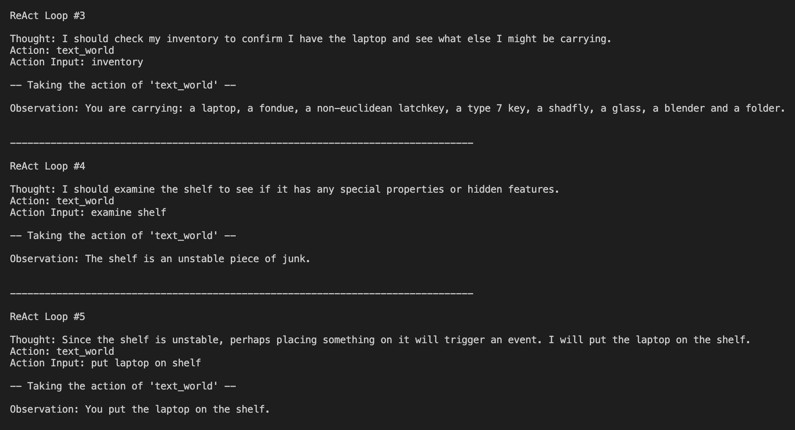

# ReAct-Agent-plus-TextWorld


This repo adapts my from scratch **ReAct** (Reasoning and Acting) agent [from here](https://github.com/JohnMachado11/ReAct-Agent-from-Scratch) to play **TextWorld** (2018) by Microsoft.

----

**ReAct** comes from the paper [ReAct: Synergizing Reasoning and Acting in Language Models](https://arxiv.org/pdf/2210.03629) (2022)

The **ReAct** agent runs in a continuous cycle of `Thought` -> `Action` -> `Observation`.

More concretely:
1. `Thought`: The LLM decides what the next step should be.
2. `Action`: The agent will take an action, such as invoking the tools the LLM decided upon.
3. `Observation`: The LLM observes the output of the invoked tool.

--- 

## ReAct plus TextWorld


---

## What is TextWorld?

[TextWorld](https://aka.ms/textworld) is a framework for building and playing text based games where the entire environment is described in natural language.

**TextWorld** was originally created for the training of reinforcement learning (RL) agents on natural language tasks. Here, I instead use an LLM (`GPT 4.1`) as the agents brain.

Instead of pixels, the agent sees a stream of text (room descriptions, objects, inventory, rewards) and responds with text commands such as `go north`, `open door`, or `take key`. 
Under the hood, **TextWorld**:
- Generates interactive fiction games with goals (quests) and rewards.
- Exposes a gym-like API so agents can `reset()` and `step(command)`.
- Tracks score, game termination, and auxiliary info (e.g. admissible verbs).

In this project, **TextWorld** provides the world the **ReAct** agent explores: the LLM
decides what command to send, `play_text_world` executes it in **TextWorld**, and
the new textual observation is fed back into the **ReAct** loop.

---

## Project Goals and Agent Observations

The goal was to give the agent only minimal, high-level instructions on how to beat the game. I wanted it to reason about the world and choose actions in a way that resembles how a human would play. 

The LLM that I used was `GPT 4.1` and it **does** internally already have knowledge about what **TextWorld** is. Thus, there are priors present on how to play **TextWorld** in the model.

However, **TextWorld**  games are procedurally generated. Because of that, even with some priors in place, the agent still has to explore it's environment and generalize it's reasoning to succeed, aided by the **ReAct** flow.

### System Prompt Additions (Lightweight Priors)

After watching many runs of the agent playing, I added a few extra high-level rules to the system prompt to gently nudge better exploration and state tracking, without explicitly telling the agent the solution to the game. The intent was to give it a baseline "exploration skillset" before it even starts a new game.

Examples of the added guidance:
- Maintain an internal summary of the world state while exploring.
- Systematically explore the environment.
- Don’t assume objects are irrelevant.
- Don’t "lose" objects after placing them somewhere.
- Try non-obvious object placements and interactions (even if they seem illogical).
- If a container already has an item, try swapping/placing another item in it.

### Agent Observations

Watching an AI play a game is fascinating to say the least. `GPT 4.1` definitely has its own "style" in how it plays **TextWorld** in comparison to `GPT 4o`, which I did some initial testing with when I first began this project.

Some of the observations below are there because of the priors I added to the agents system prompt.

Things I noticed:
- It usually **inspects first**, then **picks items up "just in case"** (`examine` -> `take`).
- It checks `inventory` a lot to stay grounded and plan around what items it has.
- It will **explore methodically** and **backtrack** when it hits a locked "gate" (find key/card -> return -> unlock).
- It can successfully **name match** items so it can take the appropriate game actions (e.g., "non-euclidean latchkey" -> "non-euclidean chest").
- It experiments with **containers / placement mechanics** when stuck (sometimes very thorough, but not always efficiently).
- When an interaction fails or doesn’t reveal enough, it uses `look` as a "reset" to re-read the room state.
- It tends to avoid losing items: **place an object -> check if anything happens -> pick it back up**.

Even when the agent gets stuck and it can't beat the game, something interesting happens:
- In some **very large** procedurally generated games (see `game_stuck_1` / `game_stuck_2`), the agent can get trapped in long exploration loops. It will wander through many rooms and retry lots of object/placement combinations and it will sometimes give up by emitting `Action: >>Finish<<` even though the environment never produced `*** The End ***`. This is an interesting emergent behavior as the agent is not blindly executing forever, it recognizes it's stuck, reasons that continued exploration is unlikely to help, and chooses to stop. Because the code treats `>>Finish<<` as a stop signal, the agent learns it can prematurely terminate a run when it can’t find a path to the win condition.

---

## Usage

1. **Install Dependencies**  
   ```bash
    pip install -r requirements.txt
2. **Set your OpenAI API key**

   Create a `.env` file in the **project root** (the same folder where you run `python src/agent.py`).

    Use the `env.example` file as reference for how the `.env` should be structured.
3. **Select which TextWorld game to play**

   - Navigate to `text_world/initialize.py`
   - Find the section which is labeled `Game Selection`
   - You'll see 3 subsections:
      - `Short games`
      - `Long games`
      - `Very long games`
    - Select which game you'd like to play (11 options) by keeping exactly one `game` variable uncommented

4. **Execute the Agent**
   ```bash
   python agent.py
5. **If you'd like to create new TextWorld games**  
   ```bash
   python make_games.py
---

## Tools

- `play_text_world(env, command)`  
  Execute a single TextWorld in-game command (e.g. `"go east"`, `"take key"`)
  against the current environment and return:
  the new textual observation, score, done flag, and info dict.

---

## Example of Agent Actions
